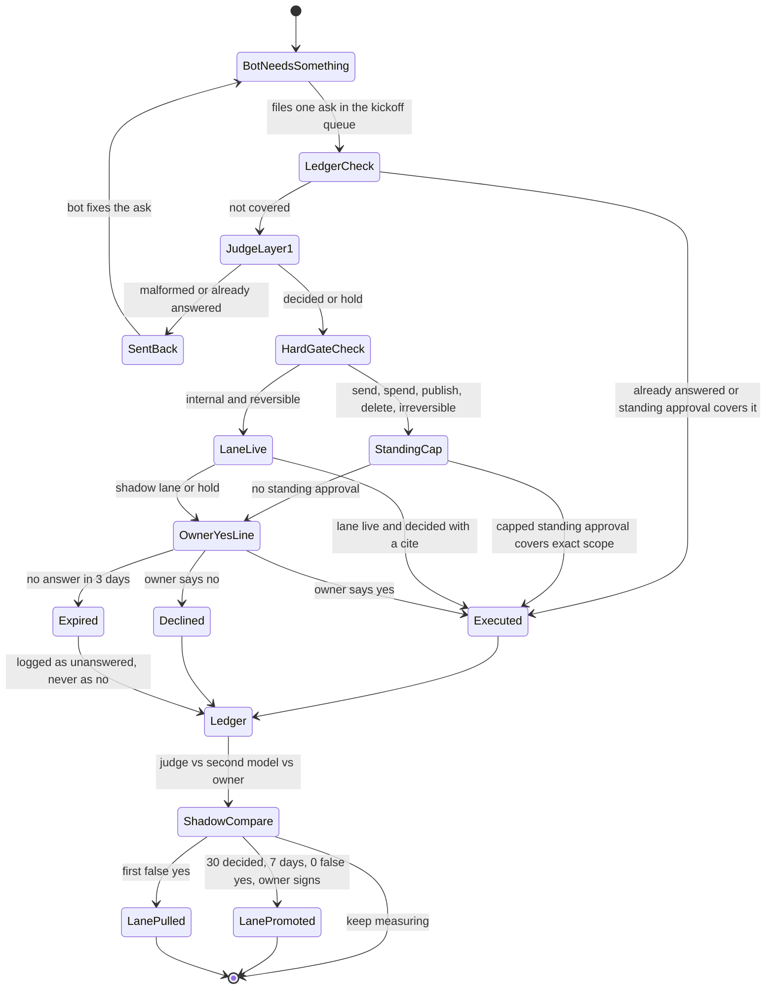
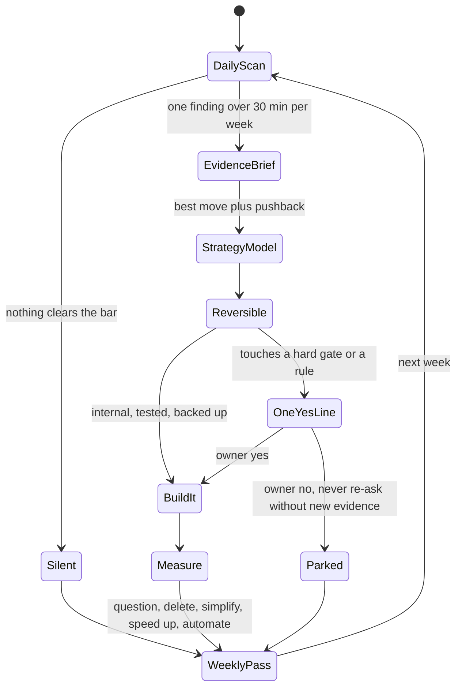

# State charts

## One ask, from need to ledger

```mermaid
stateDiagram-v2
    [*] --> BotNeedsSomething
    BotNeedsSomething --> LedgerCheck: files one ask in the kickoff queue
    LedgerCheck --> Executed: already answered or standing approval covers it
    LedgerCheck --> JudgeLayer1: not covered
    JudgeLayer1 --> SentBack: malformed or already answered
    SentBack --> BotNeedsSomething: bot fixes the ask
    JudgeLayer1 --> HardGateCheck: decided or hold
    HardGateCheck --> StandingCap: send, spend, publish, delete, irreversible
    HardGateCheck --> LaneLive: internal and reversible
    StandingCap --> Executed: capped standing approval covers exact scope
    StandingCap --> OwnerYesLine: no standing approval
    LaneLive --> Executed: lane live and decided with a cite
    LaneLive --> OwnerYesLine: shadow lane or hold
    OwnerYesLine --> Executed: owner says yes
    OwnerYesLine --> Declined: owner says no
    OwnerYesLine --> Expired: no answer in 3 days
    Executed --> Ledger
    Declined --> Ledger
    Expired --> Ledger: logged as unanswered, never as no
    Ledger --> ShadowCompare: judge vs second model vs owner
    ShadowCompare --> LanePromoted: 30 decided, 7 days, 0 false yes, owner signs
    ShadowCompare --> LanePulled: first false yes
    ShadowCompare --> [*]: keep measuring
    LanePromoted --> [*]
    LanePulled --> [*]
```

## The improvement loop

```mermaid
stateDiagram-v2
    [*] --> DailyScan
    DailyScan --> Silent: nothing clears the bar
    DailyScan --> EvidenceBrief: one finding over 30 min per week
    EvidenceBrief --> StrategyModel: best move plus pushback
    StrategyModel --> Reversible
    Reversible --> BuildIt: internal, tested, backed up
    Reversible --> OneYesLine: touches a hard gate or a rule
    OneYesLine --> BuildIt: owner yes
    OneYesLine --> Parked: owner no, never re-ask without new evidence
    BuildIt --> Measure
    Measure --> WeeklyPass: question, delete, simplify, speed up, automate
    Silent --> WeeklyPass
    Parked --> WeeklyPass
    WeeklyPass --> DailyScan: next week
```
